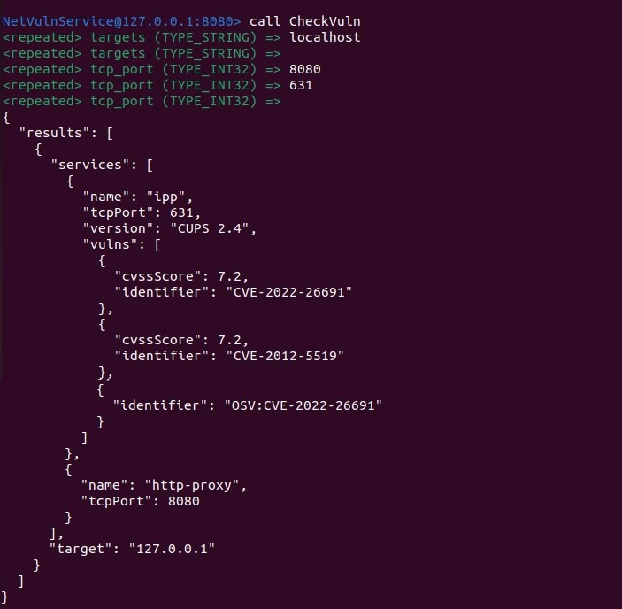

#gRPC сервис обертка над nmap
 gRPC сервис обертка над nmap с использованием следующего скрипта
https://github.com/vulnersCom/nmap-vulners и предлагаемого API:
```
syntax = "proto3";
package netvuln.v1;
service NetVulnService {
rpc CheckVuln(CheckVulnRequest) returns (CheckVulnResponse)
}
message CheckVulnRequest {
repeated string targets = 1; // IP addresses
repeated int32 tcp_port = 2; // only TCP ports
}
message CheckVulnResponse {
repeated TargetsReuslt results = 1;
}
message TargetResult {
string target = 1; // target IP
repeated Service services = 2
}
message Service {
string name = 1;
string version = 2;
int32 tcp_port = 3;
repeated Vulnerability vulns = 4;
}
message Vulnerability{
string identifier = 1;
float cvss_score = 2;
}
```
##Необходимо установить:  
- nmap  
- golangci-lint  (если требуется запускать линтер)
- go 1.18


###Для скрипта  инструкция с https://github.com/vulnersCom/nmap-vulners

(сам скрипт _(vulners.nse)_ лежит там же)

    locate where your nmap scripts are located on your system
        for *nix system it might be  ~/.nmap/scripts/ or $NMAPDIR
        for Mac it might be /usr/local/Cellar/nmap/<version>/share/nmap/scripts/
        for Windows it might be C:\Program Files (x86)\Nmap\scripts
    copy the provided script (vulners.nse) into that directory
    run *nmap --script-updatedb* to update the nmap script DB 
 
**!скрипт не работает для Windows, тк основан на распознавании версии, которая в данной системе предоставляется в другом виде!**

##Команды для запуска

####Собрать приложение:   
`make build`  
####Запуск приложения после сборки:  
`    make run  ` 
####Собрать и запустить:  
`make run2`  
или   
`make build_and_run`  
####Отчистить бинарник
`make clean`  
####Запуск тестов:  
`   make tests   `  
####Запуск линтера:  
`   make lint   `


*Замечание: может долго работать, что связанно с работой данного скрипта и nmap.*

##Изменение конфига 
в configs/config.yml

loglevel:
- panic
- fatal
- error
- warn / warning
- info
- debug
- trace


##Пример работы:
с использован  gRPC клиент _Evans_:  
```
evans pkg/protofiles/nmap.proto -p 8080   
call CheckVuln
```


